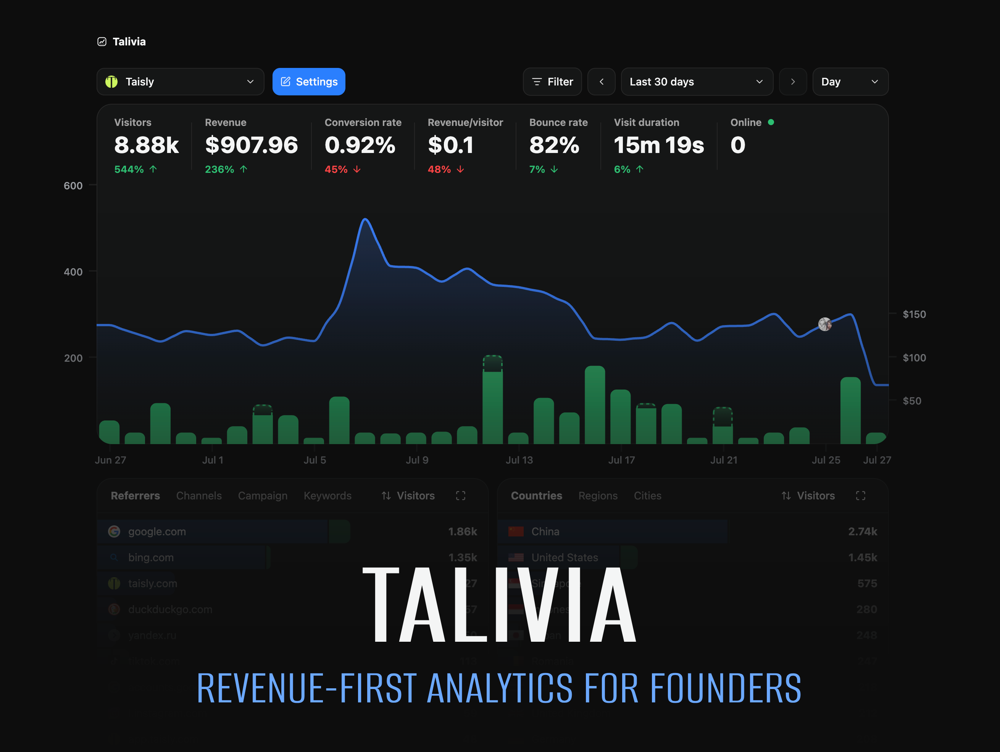

# Talivia

This repository contains the focused open-source edition of Talivia, the revenue-first analytics
platform available at [talivia.com](https://talivia.com). The self-hosted edition combines core web
analytics, Session Replay, website collaborators, shared analytics, import/export, and customer
revenue from Stripe, LemonSqueezy, Polar, Dodo, Yolfi, or the Manual Payment API.



## Open source and Talivia Cloud

The open-source edition is a self-hosted subset of the complete Talivia product. For managed
hosting and additional integrations-including Google Search Console, Bing Webmaster Tools, GitHub
activity, and social mentions from X, Reddit, TikTok and others use
[Talivia Cloud](https://talivia.com).

## Documentation

Product and integration guides are available in the
[official Talivia documentation](https://talivia.com/docs).

## Local development

Requirements: Node.js 22 LTS or 24 LTS, pnpm 10+, and an empty PostgreSQL database.

```bash
cp .env.example .env
openssl rand -hex 32
```

Put the generated value in `APP_SECRET`, then install, migrate, and start Talivia:

```bash
pnpm install --frozen-lockfile
pnpm exec prisma migrate deploy
pnpm dev
```

Open `http://localhost:3000` and sign in with:

- Username: `admin`
- Password: `admin`

Change this bootstrap password immediately under **Settings → Account**.
Administrators can create additional username/password accounts and change their roles on the same
Account page. Password hashes are never shown; every user changes their own password.

Useful checks:

```bash
pnpm lint
pnpm test
pnpm build
```

The baseline migration is for an empty database only. There is no migration path from a hosted
Talivia database.

## Configuration

Talivia has two required settings and one optional integration:

| Variable | Required | Purpose |
| --- | --- | --- |
| `DATABASE_URL` | Yes | Connection string for the PostgreSQL database. |
| `APP_SECRET` | Yes | Random value of at least 32 bytes; signs sessions and encrypts saved provider credentials. |
| `COINGECKO_API_KEY` | No | Enables crypto exchange-rate conversion. |

The application remains usable when CoinGecko is not configured or temporarily unavailable.

## First setup

1. Create a website in Talivia.
2. Copy its tracking snippet into your site.
3. Confirm that a visit appears on the dashboard.
4. Optionally enable Session Replay in website settings.
5. Connect customer revenue under **Website settings → Payments**.

Supported revenue inputs include Stripe, LemonSqueezy, Polar, Dodo, Yolfi, and the Manual Payment
API. Subscription lifecycle, refunds, disputes, and first-/last-touch attribution are retained.

Payment-provider webhook URLs are generated from the incoming request origin. When Talivia runs
behind a reverse proxy, forward the original `Host` and `X-Forwarded-Proto` headers.

## Docker

Requirements: Docker Engine with Docker Compose.

```bash
cp .env.example .env
openssl rand -hex 32
```

Put the generated value in `APP_SECRET`, then start Talivia:

```bash
docker compose up --build -d
docker compose ps
```

Open `http://localhost:3000` and change the bootstrap `admin` password immediately. The container
applies the OSS database migration automatically before starting the application.

## Backups and upgrades

Back up the PostgreSQL database and any deployment-specific storage before upgrading. For a
Compose installation, create a logical database backup with:

```bash
docker compose exec -T postgres pg_dump -U talivia -d talivia_oss > talivia-backup.sql
```

Future releases add ordered migrations under `prisma/migrations`. Apply them with
`pnpm exec prisma migrate deploy`; the official container does this during startup. Never edit a
migration that has already been applied to a persistent database.

## Security and contributions

See [SECURITY.md](SECURITY.md) for vulnerability reporting and deployment guidance, and
[CONTRIBUTING.md](CONTRIBUTING.md) for the development workflow.

Talivia is licensed under the [MIT License](LICENSE).
